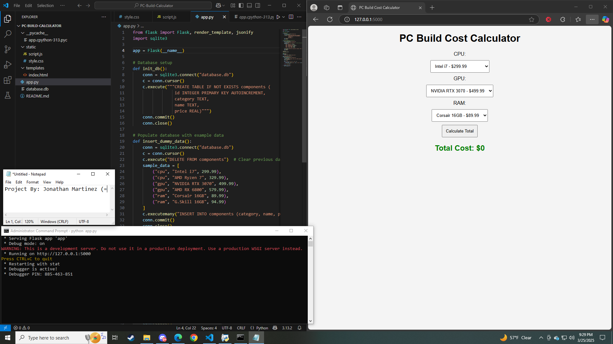

## **5️⃣ PC Build Cost Calculator (Python/JavaScript) 🖥️**

### **Description**
A script that compares component prices and helps users budget for a PC build by pulling data from online sources.

## Screenshot



### **Tech Stack**
- Python
- Flask
- JavaScript

### **Installation & Usage**
```bash
# Clone the repository
git clone https://github.com/JonathanM-Roman/PC-Build-Cost-Calculator-Python-JavaScript-.git
cd PC-Build-Calculator

# Install dependencies
pip install flask

# Run the script
python app.py
